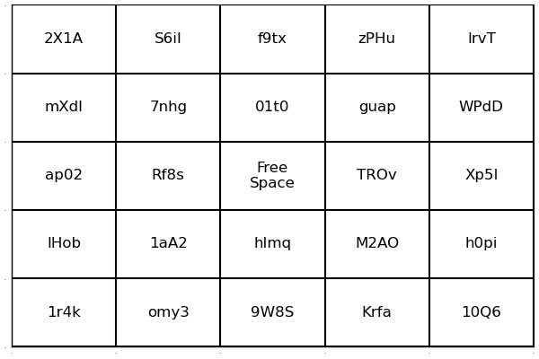

# Bingomatic

Bingomatic™ is an awesome Julia package that creates bingo cards, using state-of-the-art bingo technology.

## Installation

To install Bingomatic, switch to packge mode by entering `]` in the REPL and enter:
```julia
add Bingomatic
```
Alternatively, enter the following into the REPL:
```julia
using Pkg; Pkg.add("Bingomatic")
```

## Standard Bingo Card

A standard size bingo card can be made with a few lines of code, as shown below.
```julia
using Bingomatic, Random
Random.seed!(780775)
word_pool = map(_->randstring(4), 1:50)
words = sample_words(word_pool)
card = make_card(words)
```



## Customized Bingo Card

The example below shows that bingo cards can be be customized. It is also possible to override default values in `make_card` with variable keyword arguments.

```julia
n_rows = 3
word_pool = map(_->randstring(4), 1:50)
words = sample_words(word_pool, n_rows, n_rows)
card = make_card(words; size=(300,300))
```


## Christmas Movie Bingo

Bingomatic™ includes a bonus word pool for Christmas Movie Bingo, a $19.99 value, absolutely free! Variations of this coveted game include a tribute to the [secret word](https://www.youtube.com/watch?v=gxMZgeBlqzQ) from Pee Wee's Playhouse where players scream each time the word "Christmas" is said.  

```julia 
using Bingomatic, CSV, DataFrames, Random
Random.seed!(1225)
pkg_path = dirname(pathof(Bingomatic))
path = joinpath(pkg_path,"../extras/word_pool.csv")
word_pool = CSV.read(path, DataFrame; stringtype=String)
words = sample_words(word_pool.words) 
card = make_card(words; word_size=11, size=(630,630))
```
