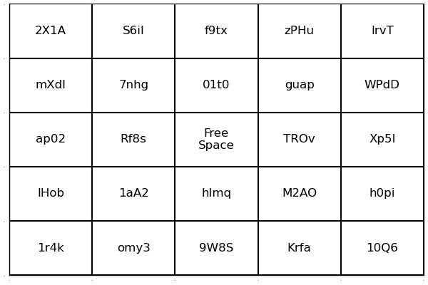

# Bingomatic

Bingomatic™ is an awesome Julia package that creates bingo cards, using state-of-the-art bingo technology.

## Standard Bingo Card

A standard sized bingo card can be made in a few lines of code, as shown below.
```julia
using Revise, Bingomatic, Random
Random.seed!(780775)
word_pool = map(_->randstring(4), 1:50)
words = sample_words(word_pool)
card = make_card(words)
```



## Customized Bingo Card

The example below shows that bingo cards can be be customized. It is also possible to override default values in `make_card` with variable keyword arguments.

```julia
n_rows = 3
word_pool = map(_->randstring(4), 1:50)
words = sample_words(word_pool, n_rows, n_rows)
card = make_card(words; size=(400,400))
```